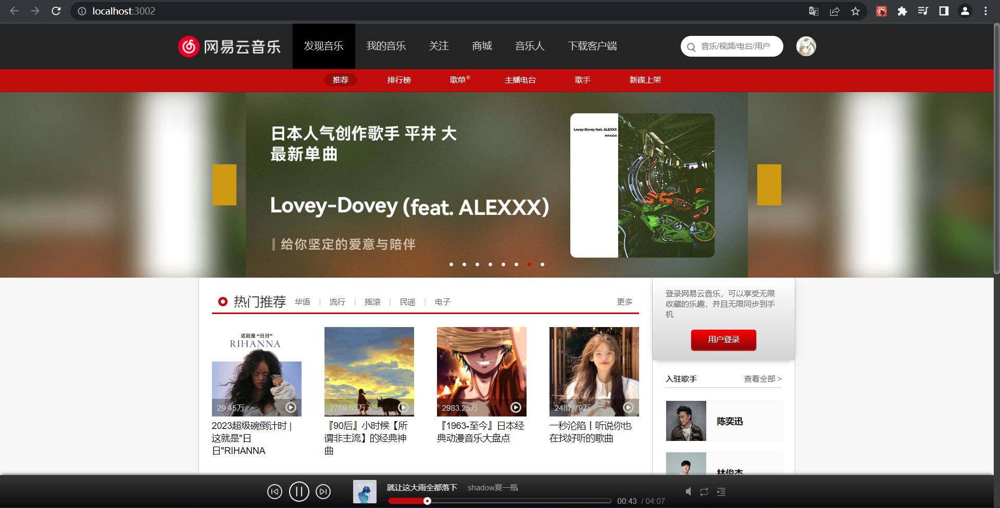
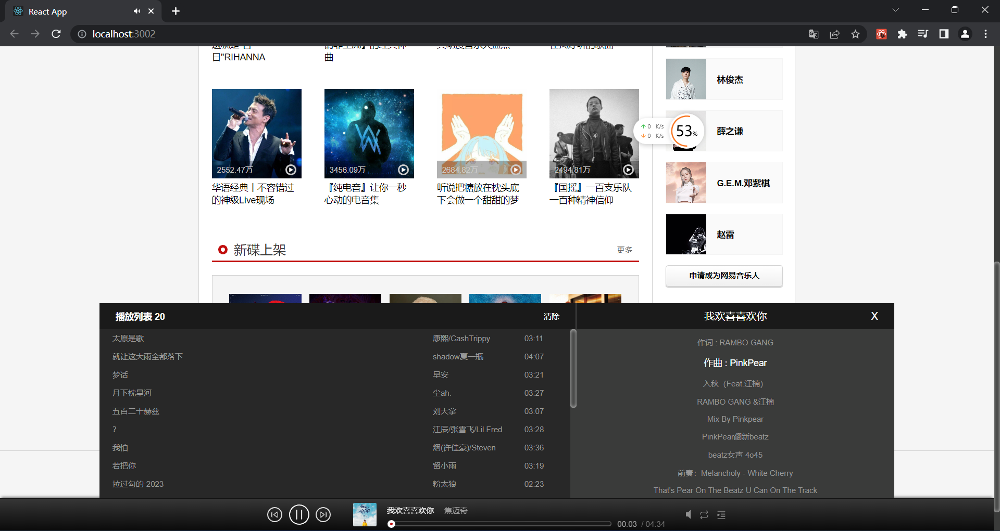
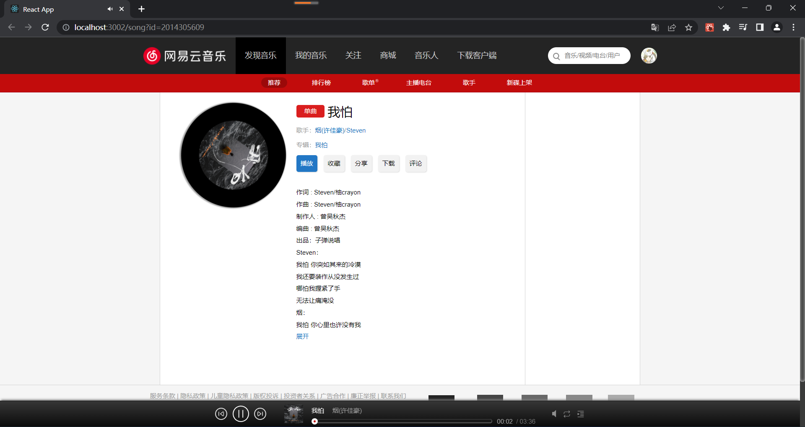

# 网易云音乐前端页面(NeteastCloudMusic)

## 项目介绍
本项目主要目的是为了进行React实践而创建，实现了基本的音乐播放，音乐管理和账号管理功能。

## 技术栈
- React: 一种声明式的用于构建用户界面的JS库，项目中使用简洁的包含Hooks的函数组件来构造用户界面。
- React-Router: 一种用于React.js的路由解决方案。
- Redux: 一种JS状态容器，由Flux演变而来，提供可预测化的状态管理。

## 页面截图
- 首页

- 音乐播放栏
- 

- 音乐详情页

